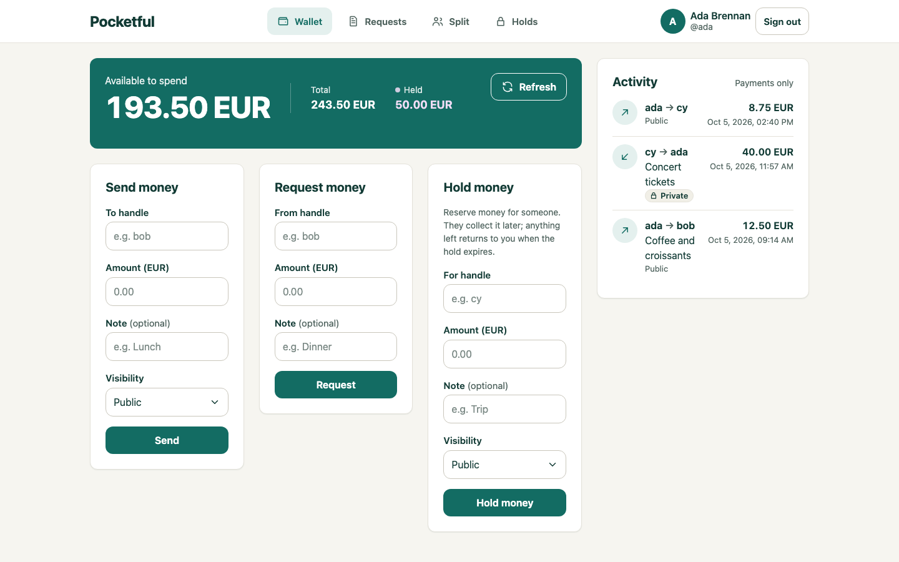
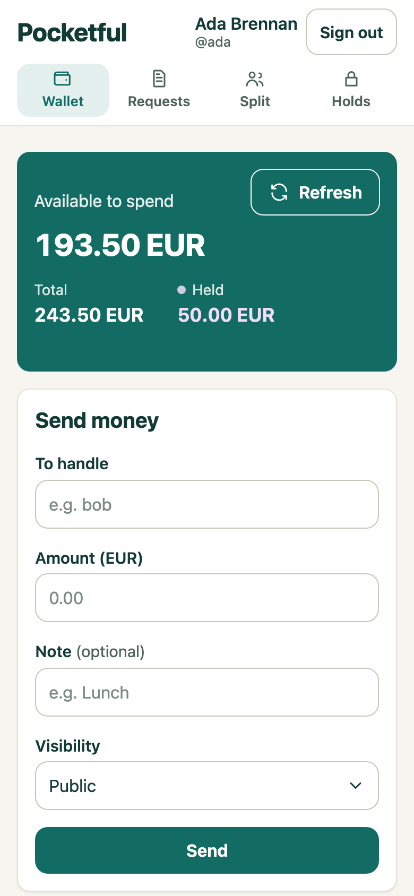
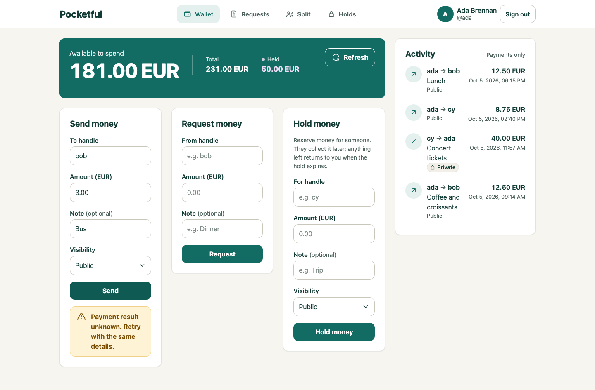
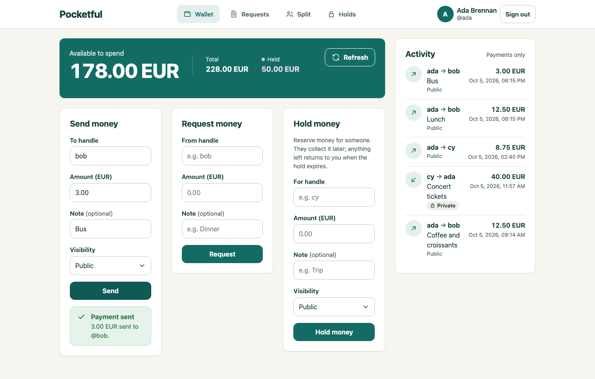

# Pocketful: the app, screen by screen

Pocketful is the wallet the factory built: pay, request, split a bill, and hold money for someone to
collect later. Every screenshot below comes from the stage-3 service (whose `ui/` is byte-identical to
`ui-core/`), with four fictional demo users: Ada Brennan (`ada`), Bob Okafor (`bob`), Cy Halvorsen (`cy`)
and Eve Lindqvist (`eve`). Desktop shots are 1440 px wide; the `phone-*` shots are a 390 px viewport at 2x.

This file and `docs/screens/` were added after the run. The UI code itself is exactly what the agents
wrote; nothing here changes it.

## Start here: four pictures

| | |
|---|---|
| **Available funds are the headline.** Total and held are secondary; held money is mauve and only mauve.  | **Same screen on a phone.** One tab row under the header, the wallet card first.  |
| **Lost response: amber, not red.** `pay-uncertain` says "Payment result unknown. Retry with the same details." The feed is not refreshed (the server may be unreachable), and the form keeps its values.  | **Retry, recovered exactly once.** Same key and body; the 3.00 EUR "Bus" payment appears once, available falls 181.00 → 178.00 once, and both error elements are gone.  |

## 1. Tour: every UI state the stage-2 spec names

Spec wording and `data-testid` names are quoted from `stage-2.md`. "Not shown" means no screenshot of that
state is in `docs/screens/`; the behaviour is covered by the drills in section 4, not by a picture.

| Spec state (testids) | What the user sees | Screenshot |
|---|---|---|
| Signup (`signup-email`, `signup-password`, `signup-display-name`, `signup-submit`) | Labelled form on the same card as sign-in | [signup](screens/signup.png) |
| Login and `auth-error` | "Email or password is incorrect." in a red box under Sign in; the email stays filled | [login-error](screens/login-error.png) |
| `current-user`, `current-handle`, `logout-button` "visible on every screen when signed in" | Avatar initial, display name, `@handle` and Sign out, top right on every route | every signed-in shot |
| `wallet-available`, "Present this as the headline number" | "Available to spend 193.50 EUR" in large type on the teal card | [home](screens/home.png) |
| `wallet-balance` (total) and `wallet-held`, "visibly secondary" | "Total 243.50 EUR" and "Held 50.00 EUR" in smaller type beside it | [home](screens/home.png) |
| `wallet-held` "Absent when `held` is zero" | Eve's wallet shows only Available and Total | [keyboard-focus](screens/keyboard-focus.png) |
| Loading ("considered empty, loading and error states") | Activity shows a three-row skeleton; the wallet card is an empty teal panel (see limitations) | [home-loading](screens/home-loading.png) |
| `pay-error`, "more than `minor_units` decimal places … without sending a request" | `15.005` → "Use at most 2 decimal places." No request is sent | [pay-invalid-amount](screens/pay-invalid-amount.png) |
| `pay-error`, "refused — including insufficient funds"; "preserves all pay inputs" | "Not enough available funds. You have 181.00 EUR available. Enter a smaller amount." Inputs kept | [pay-refused](screens/pay-refused.png) |
| Pay success; "Keep the pay form's values after success" | Green "Payment sent: 3.00 EUR sent to @bob."; the form keeps bob / 3.00 / Bus, so pressing Send again replays rather than paying twice | [pay-retry-recovered](screens/pay-retry-recovered.png) |
| `pay-uncertain` (nonempty text), "not `pay-error`" | Amber box: "Payment result unknown. Retry with the same details." | [pay-uncertain](screens/pay-uncertain.png) |
| "Successful retry removes both error/uncertainty elements … moves money exactly once" | The uncertain box is replaced by the success box; one new feed row | [pay-uncertain](screens/pay-uncertain.png) → [pay-retry-recovered](screens/pay-retry-recovered.png) |
| `wallet-refresh` | Outlined Refresh button on the wallet card (and on the Holds page) | [home](screens/home.png) |
| Request form (`request-handle`, `request-amount`, `request-note`, `request-submit`) | "Request money" card beside Send money | [home](screens/home.png) |
| `request-error` on the request form | Same red box pattern as `pay-error` | not shown |
| `activity-list`, `activity-item-*` with `data-visibility`, parties, amount, note | "ada → bob", amount, note and time; a lock "Private" pill on private payments, "Public" in grey text otherwise | [home](screens/home.png) |
| `empty-activity` | Exists in the code; rarely reachable with seeded data (see limitations) | not shown |
| `incoming-list`, `outgoing-list`, `request-item-*` with `data-status` | Two cards with counts; status pills (Pending, Declined, Cancelled); declined and cancelled rows muted | [requests](screens/requests.png) |
| `request-pay-*`, `request-decline-*` (pending incoming) and `request-cancel-*` (pending outgoing) | Pay (primary) and Decline beside a Public/Private choice; Cancel on Ada's own pending request | [requests](screens/requests.png) |
| "A request cancelled elsewhere … must show `request-error` … so the stale pay button disappears" | "This request is no longer pending. It was paid, declined or cancelled elsewhere. The list is up to date now." Bob's Taxi request now reads Cancelled, with no Pay button | [requests](screens/requests.png) → [request-refused-stale](screens/request-refused-stale.png) |
| `empty-requests` | "No requests yet" banner plus an empty state in each list | [empty-requests](screens/empty-requests.png) |
| `split-preview`, `split-share-{handle}`, "before anything is posted" | "This is a preview. No money is sent yet." 100 EUR over ada, bob, cy = 33.34 / 33.33 / 33.33, with the rounding rule in one sentence | [split-preview](screens/split-preview.png), [phone-split](screens/phone-split.png) |
| `split-error` | "One of those handles doesn't exist. Check the spelling of each handle." | [split-error](screens/split-error.png) |
| Authorise form (`authorize-*`) | "Hold money" card on the wallet and on Holds, with the pay form's input rules | [home](screens/home.png), [holds](screens/holds.png) |
| `authorize-error` "including insufficient available funds" | "Not enough available funds to hold this. You have 185.00 EUR available." | [hold-refused](screens/hold-refused.png) |
| `authorization-list`, `authorization-item-*` with `data-status` | "Your holds, 2 open · 2 closed"; Open · held (mauve), Captured (green), Expired (grey); closed holds muted | [holds](screens/holds.png) |
| `authorization-capture-amount-*`, `authorization-capture-*` (incoming open) | "Capture amount (EUR)" pre-filled with the remainder, a "Keep the rest held" box, then Collect | [holds](screens/holds.png) |
| `authorization-void-*` (outgoing open) | "Release hold" on Ada's own open hold | [holds](screens/holds.png) |
| `authorization-captured-*` (captured only) | "Captured 15.00 EUR" | [holds](screens/holds.png) |
| `authorization-expires-*` "Text is the RFC 3339 `expires_at`" | A readable line ("Expires in 3 hours (Oct 5, 2026, 09:11 PM)") over the raw RFC 3339 value | [holds](screens/holds.png) |
| Capture success | Green "Capture complete: You collected 7.00 EUR from @cy." | [hold-refused](screens/hold-refused.png) (top of the list) |
| `authorization-error` (capture or void refused) | Same red box pattern | not shown |
| `empty-authorizations` | Lock icon, "No holds yet" | [empty-holds](screens/empty-holds.png) |
| "keyboard focus must be apparent" | A 3 px teal ring with an offset; here on Sign out | [keyboard-focus](screens/keyboard-focus.png) |
| "375 CSS-pixel viewport … without horizontal page scrolling" | Single column, tab row under the header | [phone-home](screens/phone-home.png), [phone-split](screens/phone-split.png); measurements in section 3 |

## 2. Thirty-second demo (stage 3, no Docker)

From the repository root (Python 3 and curl; no packages):

```sh
cd stage-3
export POCKETFUL_DB="$(mktemp -d)/db.sqlite3"
PORT=18080 python3 server.py &
sleep 2; curl -s http://127.0.0.1:18080/health          # {"status":"ok"}

# Seed the demo users. The fixture's times are moved to "now" first, because seeded
# creation times must not be in the future and the open holds must not have expired.
python3 -c "import json,sys,datetime as d;A=d.datetime(2026,10,5,22,40,tzinfo=d.timezone.utc);s=d.datetime.now(d.timezone.utc).replace(microsecond=0)-A;f=json.load(open(sys.argv[1]));[r.__setitem__(t,(d.datetime.fromisoformat(r[t].replace('Z','+00:00'))+s).strftime('%Y-%m-%dT%H:%M:%SZ')) for k in('payments','authorizations') for r in f.get(k,[]) for t in('created_at','expires_at') if t in r];json.dump(f,sys.stdout)" ../docs/demo-fixture.json \
  | curl -s -X POST -H 'Content-Type: application/json' --data-binary @- http://127.0.0.1:18080/_test/reset
```

`server.py` reads `PORT` (default 8080) and `core.py` reads `POCKETFUL_DB`. **Use a fresh database path,
as above.** The default is a fixed file under `/tmp`, shared by every stage; a database left there by an
older stage's run can make `/_test/reset` fail. The fixture is `docs/demo-fixture.json`: four fictional users
on `example.com` addresses, password `correct horse`, three payments, three requests and four holds.

Then open http://127.0.0.1:18080/login:

1. Sign in as `ada@example.com` / `correct horse`. The headline reads **193.50 EUR available**, with total
   243.50 and held 50.00 smaller beside it.
2. Send `bob` `3.00` with the note `Bus`. The success box appears and the form keeps its values. Press
   Send again without changing anything: the balance falls once and the feed gains one row.
3. Send `9999`. You get the red "Not enough available funds" box, and the inputs stay.
4. Open **Requests**. Pay Bob's 12.00 EUR "Taxi home" request; the list and the wallet update without a
   reload.
5. Open **Holds**. On Cy's incoming 20.00 EUR hold, set 7.00 and press Collect. "Capture complete" appears,
   the hold closes as Captured, and the payment appears in Activity.

Stop the server with `kill %1`. All five steps were run against a fresh database in headless Chrome on 5 Oct 2026; the results matched: 193.50 → 190.50 after step 2, the repeat added nothing, the request read `paid`, and the hold read `captured` 7.00 EUR. The uncertain → recovered pair is not reproducible by hand against the
real server, because it needs a lost response. `ui-core/faultproxy.py` injects one (section 4).

## 3. Responsiveness (measured)

I measured `document.documentElement.scrollWidth` against `clientWidth` in headless Chrome against the
stage-3 server and the demo fixture, at viewport widths 375, 390 and 1440. I checked ten states at each
width: `/login`, the login error, `/signup`, `/` signed in, the invalid-amount `pay-error`, the
insufficient-funds `pay-error`, `/requests`, `/authorizations`, `/split`, and the split preview. All 30 had
`scrollWidth == clientWidth`, so no screen scrolls horizontally. Phone layout comes from the
`@media (max-width: 759px)` rules in `theme.css`. Navigation becomes one tab row under the header, and the
cards stack.

## 4. UI code map

The same files are in `ui-core/` (the work), `stage-2/ui/` and `stage-3/ui/` (the shipped copies).

| File | Role |
|---|---|
| `theme.css` (353 lines) | The only stylesheet. Design tokens live on `:root`: canvas, ink, primary `#136C63`, an 8 px spacing scale, 12 px corners, 44 px controls. **Each colour has one meaning:** green = success, red = refused, amber = uncertain outcome only, mauve = held money only, and no blue. Focus rings use `:focus-visible`. |
| `pocketful-core.js` (480 lines) | Logic that does not depend on any screen, exposed as `window.PocketfulCore`: `formatAmount`, `parseAmount`, `splitShares`/`splitPreview`, `KeyRing` + `canonicalJson` (an unchanged resubmit reuses the same idempotency key and body), `classify`/`Submission` (refused vs uncertain), `LatestWins`/`loadAll` (the latest refresh wins), `TokenStore`. |
| `app.js` (689 lines) | The screens: shell and navigation, wallet, the forms, the lists, and refresh. Built on the core. |
| `index.html`, `requests.html`, `split.html`, `signup.html`, `login.html`, `authorizations.html` | One static page per route, with every spec `data-testid` in the markup (36 in the HTML; list items get theirs from `app.js`). |

[`ui-core/README.md`](../ui-core/README.md) has a table mapping each core function to the spec sentence it
serves, and a "Behaviour readings" list for each judgement call the agents made where the spec was silent.

How to check it yourself:

- **Core self-test:** `node ui-core/selftest.js` (44 cases, each naming its requirement), or run
  `python3 -m http.server <port>` in `ui-core/` and open `/selftest.html`.
- **Browser drill** (Playwright core and system Chrome, desktop and 375 px):
  `PW_MODULES=<a node_modules folder containing playwright-core> ui-core/run-drill.sh [shots-dir]`.
  This runs against `ui-core/devstub.py` with fault injection. Add `UPSTREAM=http://127.0.0.1:18080` to
  drive the real service through `ui-core/faultproxy.py`, which is how the lost-response state is
  produced. Last run, against the stub: 181/181 checks passed (5 Oct 2026).

## 5. Known limitations

- **The wallet panel has no skeleton while it loads.** Activity shows skeleton rows, but the wallet card
  is an empty teal block until the numbers arrive ([home-loading](screens/home-loading.png)).
- **The raw RFC 3339 expiry is visible.** The spec says the text of `authorization-expires-{id}` *is* the
  RFC 3339 `expires_at`. The UI prints it in monospace under a readable line instead of hiding it.
- **A captured hold labels its deadline "Expiry".** A captured hold no longer expires, but its card still
  shows "Expiry (…)" with the old deadline.
- **`empty-activity` is rarely seen.** Public payments are visible to every user, so even a new user with
  no payments sees other people's public activity ([keyboard-focus](screens/keyboard-focus.png) is Eve, at
  0.00 EUR).
- **Times are shown two ways.** Requests show relative times ("just now"), while Activity and Holds show
  absolute dates and times.
- **`app.js` is one 689-line file.** It holds every screen. The logic worth testing is split out into
  `pocketful-core.js` and covered by the self-test, but the screen code is not modular.
